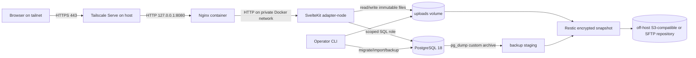

# LifeOS Website Implementation Plan

**Status:** Proposed implementation plan  
**Prepared:** 2026-09-04  
**Target:** A private, mobile-friendly LifeOS web application running on a US$5/month Linode and reachable over Tailscale HTTPS  
**Deployment reference reviewed:** `princess` commit `5dd69978641e6c24329356a81b51a8c285a4fc4d` and shared `actions` commit `5d4948b899fdda4abdcb1b80b8959030aa1571ea`

The ten Princess runs visible at review time were successful through 2026-08-30. The latest run used the optional `PRINCESS_TAILSCALE_IP` override, which is relevant to the shared-action lifecycle finding below.

## 1. Recommended direction

Build LifeOS as one SvelteKit application with a PostgreSQL database, local content-addressed media storage, Nginx as the internal reverse proxy, and Tailscale Serve as the only HTTPS entry point.

The initial production stack should contain only three containers:

1. `lifeos-app` — SvelteKit/Svelte 5 with `adapter-node`.
2. `lifeos-db` — PostgreSQL 18, pinned to a maintained minor release/image digest.
3. `lifeos-nginx` — Nginx listening only on a host loopback port.

Tailscale runs on the host and terminates HTTPS before forwarding to Nginx. There is no separate API service, Redis, message queue, object-storage gateway, Prometheus, or Grafana in the first release. The workload is small enough that those services would add more operational cost than value.

### Key decisions

| Area                | Decision                                                                                                                                       | Reason                                                                                                                                                                                        |
| ------------------- | ---------------------------------------------------------------------------------------------------------------------------------------------- | --------------------------------------------------------------------------------------------------------------------------------------------------------------------------------------------- |
| Web framework       | SvelteKit, Svelte 5, TypeScript, `adapter-node`                                                                                                | Matches `fks-web`, supports SSR and server-side form actions, and produces a standalone Node server.                                                                                          |
| Database            | PostgreSQL 18                                                                                                                                  | The source already has 36 highly relational databases. PostgreSQL provides foreign keys, transactions, JSONB for migration provenance, full-text search, and dependable dump/restore tooling. |
| Database access     | Drizzle schema/migrations plus the lightweight `postgres` driver                                                                               | Typed queries and explicit SQL migrations without a heavy runtime. Raw SQL remains available for reports and recursive task queries.                                                          |
| Application shape   | One application, not microservices                                                                                                             | Two household users and hundreds—not millions—of records do not justify distributed services.                                                                                                 |
| Authentication      | Local accounts with DB-backed sessions; first-run admin bootstrap                                                                              | Works even when external identity providers are unavailable and follows the proven `fks-web` bootstrap pattern.                                                                               |
| Authorization       | One household; `admin` and `member` roles; owner/visibility on sensitive records                                                               | Keeps setup simple while allowing journal, health, and finance records to be private when desired.                                                                                            |
| Media               | Files on a persistent volume; metadata and checksums in PostgreSQL                                                                             | Keeping hundreds of megabytes of images out of PostgreSQL makes backups, serving, and thumbnail generation simpler.                                                                           |
| Initial import      | A deterministic CLI importer that reads both Notion export ZIPs                                                                                | CSV alone loses stable relationship IDs; HTML and Markdown provide the missing IDs, page bodies, and media references.                                                                        |
| Operational backups | Full `pg_dump` custom archive plus uploads, captured by encrypted off-host Restic snapshots                                                    | Avoids the “forgot to list a new table” risk of table-by-table data-only backups and handles large, duplicate-heavy media efficiently.                                                        |
| Deployment          | Reuse the Princess provision/Tailscale/SSH/notification pattern, but build in CI, publish a commit-addressed image to GHCR, and pull on Linode | The Princess workflow is a proven Nanode baseline; building SvelteKit on a 1 GB machine and treating a stateful app like an Nginx-only edge are avoidable risks.                              |
| Access              | Tailscale Serve only; never Tailscale Funnel                                                                                                   | This is a private household system containing health, financial, journal, and contact information.                                                                                            |

### Why PostgreSQL rather than SQLite

SQLite would run this traffic easily and would use less memory. It is a reasonable fallback if the only goal were a single-user notes application. PostgreSQL is still the better choice here because:

- the export has many-to-many relationships across tasks, projects, goals, habits, daily logs, recipes, ingredients, people, tags, and dates;
- import validation benefits from constraints, transactions, staging tables, and JSONB;
- concurrent browser tabs and two users should not have to coordinate around a single writer;
- full-text search and reporting queries can remain in the same database;
- `pg_dump`/`pg_restore`, migration roles, and recovery procedures already match the operator's `fks-web` experience; and
- a carefully tuned PostgreSQL instance is entirely adequate for this workload on a 1 GB Nanode.

Performance is not the deciding factor—the current dataset is tiny. Data integrity, migration fidelity, and recovery are.

## 2. What was found in the exports

The attached documents were reviewed strictly as source data. Text inside them is not treated as project instruction.

### Export inventory

| Export              | Extracted size | Contents                                         |
| ------------------- | -------------: | ------------------------------------------------ |
| Markdown/CSV export |         129 MB | 504 Markdown pages, 244 CSV files, 202 PNG files |
| HTML/assets export  |         285 MB | 520 HTML pages, 36 CSV files, 323 PNG files      |
| Combined            |         414 MB | 1,829 files after extraction                     |

Important details:

- There are **36 canonical `_all.csv` databases containing 436 total rows**.
- Every canonical `_all.csv` has the same row count as its main non-`_all` counterpart.
- The remaining CSV files are rendered/filtered Notion views. Of them, 204 map cleanly to one canonical schema, three are ambiguous subsets, and one Wheel of Life view has a duplicate `Life Areas 1` heading.
- The Markdown export ZIP contains 17 duplicate archive paths. Several duplicates have different content because Notion emitted different filtered views to the same filename. The importer must never use “last extracted file wins” for these paths. Canonical `_all.csv` files are the row inventory.
- All 504 Markdown page IDs also exist in the HTML export. The HTML export adds 16 top-level database pages that Markdown represents as CSV instead of pages.
- The HTML export contains 298 unique PNG contents. All 196 unique images from the Markdown export are included, plus 102 unique HTML-only images.
- Across both extracted exports there are 214 duplicate-content groups containing 491 files. Media must be deduplicated by SHA-256 rather than by filename.
- HTML table rows and relation links retain `data-notion-page-id`, which is the strongest available relationship key. CSV relation cells often contain only display names and are unsafe for joining when titles are duplicated.
- The exports preserve the _results_ of formulas, rollups, buttons, filters, and sorting, but do not reliably preserve their definitions. Exact Notion view rules and formula expressions must be captured from the live workspace before final cutover.
- The System page links an `Accounts Database`, but no Accounts database file was present. The `Life Admin Database` page also has no canonical data table in these exports. These may be empty; confirm in Notion and re-export them directly if they contain data.
- Some dashboards are well developed, while Content Creation, Etsy Store Manager, Financial Hub, Health & Fitness, Reading Tracker, and Perspectives are mostly placeholders. Their final behavior should not be invented solely from the export.
- External embeds include Indify clock/timer/weather widgets and Viewday. Decide individually whether to replace these with native UI, retain links, or omit them. Do not silently ship third-party frames on pages containing sensitive data.

### Visual direction present in the source

The source is visually distinct from `fks-web`: warm cream backgrounds, paper texture, watercolor illustrations, botanical imagery, muted sage/dusty-blue/pink accents, scrapbook-like cards, and friendly handwritten/serif display type. Preserve that emotional tone rather than reusing the FKS terminal theme.

Keep the source artwork as imported user media, but optimize delivery:

- preserve one original by checksum;
- generate 320 px, 640 px, and 1280 px WebP derivatives during import;
- process one image at a time on the small server;
- use responsive `srcset`, explicit dimensions, lazy loading, and immutable cache names; and
- never render imported raw HTML without sanitization.

## 3. Scope and delivery strategy

### Default product assumptions

- One household with up to a few users.
- The first user is an administrator; the wife can be the primary owner of the imported workspace data.
- Shared-by-default modules: tasks, projects, goals, areas, habits, meals, shopping, recipes, important dates, media, and household contacts.
- Private-by-default modules: journal narrative, health records, and financial entries. A record can be explicitly shared with the household.
- Default timezone: `America/Toronto`.
- Store instants as UTC `timestamptz`; store human calendar days as PostgreSQL `date` so daylight-saving changes do not move a daily log to another day.
- Default currency: CAD, stored with an ISO currency code and exact decimal amounts—not floating point.
- Notion remains the source of truth during development. LifeOS becomes the sole writer only after a planned final import. There will be no bidirectional Notion sync in the initial project.

### MVP cut line

The first genuinely usable release should include:

- first-run admin setup, member invitation/creation, login/logout, session revocation, and account recovery;
- a responsive application shell and Home/Today dashboard;
- Quick Capture/Inbox;
- tasks, projects, goals, life areas, tags, important dates, and global search;
- daily logs and habit tracking;
- deterministic import of the attached Notion data and media with a validation report;
- portable household data export;
- operational backup, verified restore, and fresh-host bootstrap;
- Nginx/Tailscale deployment to the Linode; and
- mobile-focused Playwright coverage for the main flows.

After that foundation is stable, add feature packs in this order:

1. Knowledge/library and people/places.
2. Recipes, ingredients, meal planning, prep tasks, pantry/shopping.
3. Health, symptoms, vitamins, activities, exercises, medical visits, and pets.
4. Finance, recurring expenses, savings/funding, income, spending, and accounts.
5. Media tracking, wishlist, significant events, and yearly review/Wheel of Life.
6. Content Creation, Etsy, Perspectives, and any other placeholder dashboards only after their requirements are defined.

This ordering gets the daily operating loop into the wife's hands without making every Notion experiment a launch blocker.

## 4. Architecture



### Request path

1. A tailnet user opens `https://<lifeos-host>.<tailnet>.ts.net`.
2. Tailscale terminates TLS and proxies to `http://127.0.0.1:8080`.
3. Nginx adds/overwrites trusted forwarding headers, compression, body-size limits, cache headers, and security headers.
4. SvelteKit validates the session and authorization on every server load/action.
5. Only server code accesses PostgreSQL and the uploads volume.

### Origin and CSRF handling

Use an explicit production `ORIGIN=https://<lifeos-host>.<tailnet>.ts.net`. Do not combine it with competing header-derived origin settings. This avoids the `fks-web` failure mode where the browser uses HTTPS but an HTTP-only Nginx hop reports `X-Forwarded-Proto: http`, causing valid form posts to be rejected as cross-site.

The deployment test must submit a login form with the real tailnet `Host` and HTTPS `Origin`; testing only through `localhost` is insufficient.

### What to carry forward from FKS—and what to change

| Carry forward                                       | Change for LifeOS                                                                                                      |
| --------------------------------------------------- | ---------------------------------------------------------------------------------------------------------------------- |
| SvelteKit + `adapter-node`                          | Keep app and infrastructure together in this small repo.                                                               |
| Nginx behind Tailscale HTTPS                        | Use a single small site config and an explicit production origin.                                                      |
| Loopback-only published ports                       | Do not publish PostgreSQL at all in production.                                                                        |
| DB-backed opaque sessions                           | Reduce application roles to `admin` and `member`.                                                                      |
| Random first-run admin credential and forced change | Add household ownership and privacy defaults.                                                                          |
| Scoped runtime database role                        | Use a separate migration role and versioned migrations on every host, not initdb-only schema creation.                 |
| Scripted `run.sh` operations                        | Keep the dispatcher thin and put substantial logic in focused scripts.                                                 |
| Health checks and rotated container logs            | Skip the heavy monitoring stack on 1 GB; expose simple health and backup status.                                       |
| Encrypted state backups                             | Use full database archives and Restic for bulk media instead of committing repeated 400+ MB encrypted tarballs to Git. |

### Princess repository review and exact adaptation

The reviewed Princess repository is the closest deployment reference. Its split between a manual, idempotent Linode provision workflow and a Tailscale-only deploy workflow is the correct base for LifeOS. Reuse the shape and shared actions, not the Princess-specific certificate/DNS behavior.

| Princess behavior                                                                                                                                              | LifeOS decision                                                                                                                                                                                                                                                     |
| -------------------------------------------------------------------------------------------------------------------------------------------------------------- | ------------------------------------------------------------------------------------------------------------------------------------------------------------------------------------------------------------------------------------------------------------------- |
| Manual `provision.yml` requires typing the instance name before creating a billable Linode                                                                     | Reuse; require `lifeos`, default to `g6-nanode-1`, `ca-central`, and the current chosen Ubuntu LTS image.                                                                                                                                                           |
| Linode API lookup by label makes provisioning rerunnable                                                                                                       | Reuse; if `lifeos` exists, validate/bootstrap it rather than creating a duplicate.                                                                                                                                                                                  |
| Runner creates a one-run Ed25519 root key, injects it during instance creation, waits for cloud-init, then removes it                                          | Reuse. It avoids a permanent bootstrap key and gives deterministic first provisioning.                                                                                                                                                                              |
| `ROOT_PASSWORD` exists for Linode/Lish recovery while password SSH is disabled                                                                                 | Reuse, store it outside GitHub as recovery material too, and test the Lish path once.                                                                                                                                                                               |
| Cloud-init creates `actions`/operator users, hardens SSH, enables unattended upgrades, fail2ban, UFW, Docker log rotation, Tailscale, and Docker boot ordering | Reuse after removing edge/exit-node settings and parameterizing operator keys instead of embedding project-specific values. Add 2 GB swap, `/srv/lifeos`, backup timers, disk alerts, and restrictive persistent-directory ownership.                               |
| Princess is advertised as `tag:ci` and an exit node                                                                                                            | Change the server to `tag:lifeos`; reserve `tag:ci` for ephemeral GitHub runners. Do not advertise an exit node, accept routes, enable forwarding, or enable non-local bind unless a separate requirement appears.                                                  |
| Runner joins Tailscale using the shared `tailscale-connect` action, discovers the server by hostname, and optionally accepts a 100.x override                  | Reuse the pattern with hostname `lifeos` and optional `LIFEOS_TAILSCALE_IP`, but first fix the shared action's premature logout described below. Prefer MagicDNS name resolution; the IP is a recovery override, not primary configuration.                         |
| Cloudflare DNS points a public name at the Tailscale IP and CI manages a Let's Encrypt wildcard certificate                                                    | Do not copy. LifeOS uses its `*.ts.net` MagicDNS name and Tailscale Serve TLS. It needs no Cloudflare DNS job, Certbot schedule, wildcard certificate, or `ssl-certs` volume.                                                                                       |
| Nginx binds ports 80/443 directly to the host's Tailscale IP                                                                                                   | Change to Nginx on `127.0.0.1:8080` and Tailscale Serve on tailnet HTTPS 443. Neither 80 nor 443 is opened on the public interface.                                                                                                                                 |
| Princess clones/pulls the repo and builds Nginx on the server                                                                                                  | Change to a CI-built multi-architecture/`linux/amd64` SvelteKit image in GHCR, referenced by commit SHA and deployed by digest. The Nanode only pulls images and starts services.                                                                                   |
| `ssh-deploy` can keep named infrastructure services alive while replacing app services                                                                         | Reuse through a LifeOS-specific custom deploy command: `lifeos-db` stays running while `lifeos-app` and `lifeos-nginx` are replaced. Pull the image before stopping anything.                                                                                       |
| Deploy uses `git pull                                                                                                                                          |                                                                                                                                                                                                                                                                     | git reset --hard` on a branch | Change to an exact commit/release bundle. Never let a retry silently deploy a different commit; never overwrite an unexpected dirty checkout. |
| Workflow concurrency uses `cancel-in-progress: true`                                                                                                           | Change to one production environment with `cancel-in-progress: false`. Do not cancel a backup or migration halfway through. Add a remote deployment lock as a second guard.                                                                                         |
| Health check is advisory with `fail-on-unhealthy: false`                                                                                                       | Change to a hard release gate. Verify DB, app, Nginx, and the real Tailscale HTTPS path; notify failure and retain the previous image reference.                                                                                                                    |
| Shared actions are consumed as `nuniesmith/actions/...@main`                                                                                                   | Reuse unchanged; pin each shared action to a reviewed commit SHA so an edit made for another repo cannot retarget LifeOS deploys. Update pins deliberately.                                                                                                         |
| SSH disables host-key verification                                                                                                                             | Prefer Tailscale SSH. If standard SSH is retained, capture/pin the host key after provisioning in `SSH_KNOWN_HOSTS`; do not use `StrictHostKeyChecking=no` for routine deploys.                                                                                     |
| Permanent inbound SSH private keys are generated on the server and manually copied to GitHub secrets                                                           | Preserve this only if matching Princess exactly is more valuable than cleanup. Preferred LifeOS setup: generate a dedicated CI key off-server, provision only its public key, store the private key in `SSH_KEY`, and keep the operator/root recovery key separate. |
| Discord deploy/provision summaries use the shared notification action                                                                                          | Reuse, but notifications must distinguish tests, backup, migration, rollout, health, rollback, and restore-required failures. Never include private app data or secret values.                                                                                      |

The shared `tailscale-connect`, `ssh-deploy`, `health-check`, and `discord-notify` actions are the production path for Princess and are reused unchanged by LifeOS. One quirk must be inherited knowingly rather than fixed.

`tailscale-connect` runs three steps — connect (`tailscale/github-action@v4`), verify, then a cleanup step at `if: always()` that calls `tailscale logout` (`.github/actions/tailscale-connect/action.yml:136-144`). Composite actions have no post-job hook, so `if: always()` means "even if earlier steps failed", not "at job end": that logout runs inline as the composite's last step, and every caller step after it runs post-logout.

Princess is green in production regardless, for two reasons that LifeOS must replicate rather than rely on by accident:

1. `ci-cd.yml:72` passes `OVERRIDE: ${{ secrets.PRINCESS_TAILSCALE_IP }}`, so the resolve step never needs tailnet DNS. **This secret is load-bearing, not optional** — `provision.yml:19` describes it as "only an optional override", which is the one piece of Princess documentation that is wrong, because the documented fallback (`tailscale ip -4 princess`) executes _after_ the logout.
2. The connect step runs the daemon as root while cleanup calls bare `tailscale logout` with stderr discarded — a mutating command from an unprivileged shell, which almost certainly fails silently and leaves the tunnel up.

**Decision: do not "fix" the shared composite for LifeOS.** Editing an action that Princess depends on, to correct a defect that is not currently costing anything, is risk without benefit. LifeOS sets `LIFEOS_TAILSCALE_IP` and passes it exactly as Princess does. Pinning to reviewed SHAs (OPS-008) is what protects LifeOS here: it means a future edit made for another repository cannot silently retarget LifeOS deploys. If the composite is ever repaired, do it as its own change with Princess re-tested, and add a caller-level test proving a step **after** the composite can resolve and reach the target with no IP override.

LifeOS should use `ssh-deploy` with a custom stateful deploy command rather than its default stop/pull/start flow, because the default stops app services before pulling and has no database backup/migration transaction boundary. The existing health action can be reused only with `fail-on-unhealthy: true`; the deploy notification must use the combined deploy-and-health result, not only `steps.deploy.outcome`.

## 5. Proposed repository layout

```text
lifeos/
├── .github/workflows/
│   ├── ci.yml
│   ├── provision.yml
│   └── deploy.yml
├── migrations/
│   └── 0001_initial.sql
├── scripts/
│   ├── backup.sh
│   ├── restore.sh
│   ├── verify-backup.sh
│   ├── deploy.sh
│   └── doctor.sh
├── src/
│   ├── lib/
│   │   ├── components/
│   │   ├── server/
│   │   │   ├── auth/
│   │   │   ├── db/
│   │   │   ├── import/
│   │   │   ├── repositories/
│   │   │   ├── services/
│   │   │   └── storage/
│   │   ├── styles/
│   │   └── validation/
│   └── routes/
│       ├── (auth)/
│       ├── (app)/
│       └── api/health/
├── tests/
│   ├── fixtures/
│   ├── integration/
│   └── e2e/
├── infrastructure/nginx/default.conf
├── provision/cloud-init.yaml
├── var/                         # gitignored local runtime data
│   ├── imports/
│   ├── uploads/
│   └── backups/
├── .dockerignore
├── .env.example
├── .gitignore
├── compose.yml
├── compose.prod.yml
├── Dockerfile
├── package-lock.json
├── package.json
├── run.sh
└── IMPLEMENTATION_PLAN.md
```

The Notion ZIPs and extracted personal data must never be committed. Add import archives, extracted content, dumps, uploads, `.env`, Restic credentials, and generated reports containing private values to `.gitignore` before copying anything into the repo.

## 6. Target data model

### Shared conventions

Every user-owned domain table should have:

- an application-generated UUID primary key;
- `household_id` and, where relevant, `owner_user_id`;
- optional `notion_page_id UUID UNIQUE` and `source_record_id` for migration provenance;
- `visibility` where records may be private;
- `created_at`, `updated_at`, `created_by`, and `updated_by`;
- `archived_at` for recoverable deletion; and
- a version/increment or `updated_at` precondition for optimistic concurrency.

Use foreign keys and join tables for real relationships. Do not reproduce Notion as an entity-attribute-value schema. Keep unmapped source values in import provenance JSONB so no information is silently discarded.

### Platform tables

- `users`, `sessions`, `invites`, `auth_audit`
- `households`, `household_members`
- `app_settings`
- `schema_migrations`
- `import_runs`, `import_sources`, `source_records`, `source_links`, `import_issues`
- `attachments`, `attachment_links`
- `change_log` for destructive/admin operations

### Source-to-target mapping

| Source database                 |    Rows | Target/handling                                                           | Release     |
| ------------------------------- | ------: | ------------------------------------------------------------------------- | ----------- |
| Areas                           |      15 | `areas`; review schedule stored, activity counts queried                  | MVP         |
| Tasks                           |      32 | `tasks`, `task_dependencies`, task hierarchy; `Type=Milestone` retained   | MVP         |
| Projects                        |       7 | `projects`, project-goal/project-area links; health/progress derived      | MVP         |
| Goals                           |       5 | `goals`, goal-area and goal-habit links; progress derived                 | MVP         |
| Habit Tracker                   |       5 | `habits`, `habit_logs`; enforce one habit/date log                        | MVP         |
| Daily Log                       |      25 | `daily_logs` plus typed measurements and join tables                      | MVP         |
| Important Dates                 |       1 | `important_dates`, recurrence rule, people links                          | MVP         |
| Tags & Topics                   |      15 | `tags`, `entity_tags`                                                     | MVP         |
| System Status                   |       1 | Do not treat as canonical data; replace with live dashboard queries       | MVP         |
| Master Dashboards               |      29 | Navigation/feature configuration; do not expose as an editable user table | MVP         |
| Library                         |      41 | `library_items`, item relations, rich content                             | Pack 1      |
| People & Places                 |      10 | `people_places`, typed relationships, contact fields                      | Pack 1      |
| Wishlist                        |       4 | `wishlist_items`, people/date/project links                               | Pack 1 or 5 |
| Recipes                         |      17 | `recipes`, rich instructions, nutrition, media, tags                      | Pack 2      |
| Ingredients                     |      68 | `ingredients`; split pantry/shopping state from ingredient identity       | Pack 2      |
| Meal Plan                       |      14 | `meal_plans`, `meal_plan_slots`, daily-log links                          | Pack 2      |
| Prep Tasks                      |       5 | `meal_prep_tasks`, recipe links                                           | Pack 2      |
| Medical Visit Log               |       1 | `medical_visits`, provider/place/person/media links                       | Pack 3      |
| Symptoms                        |      42 | `symptom_definitions`, `symptom_logs` reconstructed from date relations   | Pack 3      |
| Vitamins                        |       2 | `supplements`, `supplement_logs`                                          | Pack 3      |
| Activity                        |       8 | `activity_definitions`, `activity_logs`                                   | Pack 3      |
| Exercise                        |       5 | `exercise_definitions`, `exercise_logs`                                   | Pack 3      |
| Mood/Feelings                   |      24 | `mood_definitions`, `daily_log_moods`                                     | Pack 3      |
| Energy Level                    |       6 | `energy_definitions`, daily-log reference                                 | Pack 3      |
| Pet                             |       1 | `pets`, pet/visit links                                                   | Pack 3      |
| Recurring Expenses              |       1 | `recurring_expenses`; compute monthly equivalent                          | Pack 4      |
| Savings & Funding               |       1 | `funding_goals`, account/project/goal links                               | Pack 4      |
| Income                          |       1 | `income_entries`                                                          | Pack 4      |
| Spending                        |       1 | `spending_entries`                                                        | Pack 4      |
| Money by Month                  |       1 | Preserve notes, but replace totals with monthly SQL queries/views         | Pack 4      |
| Accounts                        | missing | Confirm/re-export; create `financial_accounts` even if currently empty    | Pack 4      |
| Movies & TV                     |       7 | `media_items`, watch progress/history                                     | Pack 5      |
| Media Picker                    |       1 | Saved picker preferences/query, not a separate content collection         | Pack 5      |
| Highlights & Significant Events |       4 | `significant_events`                                                      | Pack 5      |
| Wheel of Life                   |      22 | `wheel_ratings` keyed by area and review date/year                        | Pack 5      |
| Months                          |      12 | Calendar/reporting view; do not store derived aggregates as truth         | Pack 5      |
| Years                           |       2 | Annual reporting view plus user-authored yearly notes                     | Pack 5      |

### Important normalization decisions

- `System Status`, progress percentages, overdue flags, “needs review,” counts, next-review dates, month/year rollups, and report strings are computed presentation data. Recompute them from normalized records rather than importing them as truth.
- Notion button fields such as `Log Today`, `Complete`, `Pause`, `Resume`, `Add to List`, and `Mark as Reviewed` become server actions with authorization, validation, and transactions.
- Keep task status values compatible with the source (`In inbox`, `To Do`, `In Progress`, `Done`) but centralize them in domain code. Preserve the original label in provenance during import.
- A recurring task creates its next occurrence atomically when completed. Avoid a scheduler for this initial use case.
- `daily_logs` are unique per owner and local date. Habit, symptom, mood, activity, exercise, vitamin, meal, and health entries relate to that daily record through join/log tables.
- Recipe body Markdown is valuable content and must be preserved. Structured recipe ingredients should be parsed where confidence is high; the original body remains available even when a quantity cannot be normalized.
- Pantry state and shopping state are not properties of a universal ingredient. Split them into `pantry_items` and `shopping_items` so one ingredient can be in a recipe without always being “in stock” or “on the list.”
- Use PostgreSQL `numeric` for money and measurements that require exact decimals. Store a unit alongside health/nutrition measurements.
- Use lookup tables or checked text values for user-editable categories. Avoid PostgreSQL enums for lists the household may customize frequently.

## 7. Notion import design

### Import guardrails

- The importer is an operator CLI, not a public endpoint.
- It accepts the original ZIP paths and reads entries safely without blindly extracting paths supplied by the archive.
- Reject absolute paths, `..` traversal, symlinks, unexpected file types, oversized individual files, and decompression limits above a configured threshold.
- Inventory duplicate ZIP entry names. For the 17 duplicate paths in the Markdown ZIP, never choose an entry based on position; use `_all.csv` for rows and record every variant in the report.
- Run in `--dry-run` by default. A real import requires an explicit target household and owner.
- Create an `import_run` with source SHA-256 hashes, importer version, app commit, timestamps, and status.
- Import into staging/provenance tables first. Promote to domain tables in a transaction after validation.
- Be idempotent by `notion_page_id` and source checksum. A rerun updates the same imported record or reports a conflict; it does not duplicate data.
- Never overwrite a record edited in LifeOS after its source import unless `--replace-imported` is explicitly requested.

### Source precedence

Use the two exports together:

1. **`_all.csv`** — canonical database list, row count, and complete rendered property values.
2. **HTML database tables and item pages** — stable page IDs, structured relation targets, property-type hints, time values, checkbox state, and HTML-only media.
3. **Markdown item pages** — readable rich body content, links, nested task lists, and a simpler fallback for item properties.
4. **Filtered/view CSVs** — validation only; never canonical input.
5. **Rendered formula/rollup values** — comparison fixtures used to test the replacement query, not long-term source-of-truth fields.

### Driver type conversion is not relied on

**JSON parameters must be cast twice: `${JSON.stringify(x)}::text::jsonb`.**

A single `::jsonb` cast behaves differently depending on where the code runs.
In the bundled server the driver applies no conversion, so the stringified JSON
lands correctly. Under plain `node` — which is how the CLIs run — the driver
sees a jsonb-typed parameter and JSON-encodes the string _again_, storing a
JSON scalar instead of an object.

This was found because the importer promoted 31 tasks with every field null.
Nothing errored: `raw` was a JSON string, so every `raw['Do Date']` was
`undefined`, and only the two mappers that _require_ a date returned early and
gave the symptom away. Tables that fall back to defaults imported silently and
looked successful. Forcing the parameter to text first makes both environments
agree.

The `postgres` driver's JS type conversion does not apply in the bundled server
build, in either direction, and this was found three times before the pattern
was recognised:

- a JS `Date` parameter reached the wire unconverted, failing every sign-in;
- the driver's `json()` helper marker did the same, aborting first-run bootstrap; and
- `timestamptz` columns came back as **strings**, so `.getTime()` threw inside
  session resolution and silently sent every authenticated request down the
  anonymous path — a successful login that bounced straight back to `/login`.

Each failure appeared only in production while the whole test suite stayed
green, because tests import `src/` and the server runs `build/`.

**Rules, applied everywhere:** send timestamps as ISO strings with an explicit
`::timestamptz` cast (or use `now()`), send JSON as `JSON.stringify(...)::jsonb`,
and read every timestamp through `toDate`/`toDateOrNull` in
`src/lib/server/db/coerce.ts`. Never assume a driver-parsed type in either
direction. `scripts/verify-first-run.sh` exercises the built artifact so this
class is caught by CI rather than in use.

### Verified source-format hazards

Measured against the export in `data/` (36 `_all.csv`, 436 canonical rows, 504 Markdown pages, 525 image files / 298 unique by SHA-256 — all four figures match the acceptance baseline below). Each hazard below is confirmed present in this data, not anticipated:

| Hazard                                             | Evidence in this export                                                                                                              | Required handling                                                                                                                                                              |
| -------------------------------------------------- | ------------------------------------------------------------------------------------------------------------------------------------ | ------------------------------------------------------------------------------------------------------------------------------------------------------------------------------ |
| **UTF-8 BOM on the first column**                  | The Tasks header parses as `Task`, not `Task`                                                                                       | Read every CSV with `utf-8-sig`. A header-name check that misses this fails to find the title column of all 36 databases.                                                      |
| **Embedded newlines inside cells**                 | Goals: 46 physical lines / 5 rows; Areas: 39 / 15. Multi-line values like `Task Overview` span lines.                                | Row counts must come from a real CSV parser. Any validation that counts lines will report wrong totals and can never satisfy the 436-row gate.                                 |
| **Commas inside titles**                           | 32 titles, e.g. `Andrea Hunt, NP`, `@August 9, 2026`                                                                                 | Multi-value relation cells are comma-joined, so splitting on `, ` corrupts these. Split on the `)` boundary or extract the 32-hex ID.                                          |
| **Duplicate titles within one database**           | 10 groups: `Carrots` ×2 (Ingredients), `New Task TEMPLATE` ×3, all seven `…’s Menu` ×2 (Meal Plan)                                   | Title is **not** a key. Resolve relations by Notion ID only; a title-keyed join silently misattributes.                                                                        |
| **Relations carry the ID in a URL-encoded path**   | `Sweet Potato (Ingredients%20Database/Sweet%20Potato%203c8879a556f1803b8f0df37147b3aae7.csv)` — 576 relation cells, 116 multi-valued | Percent-decode, then take the trailing 32-hex ID as the foreign key. The leading title is display text only.                                                                   |
| **Formula/rollup values are pre-rendered strings** | `Past Deadline? = Yes`, `Subtask Report = ↳ 4 Sub-Tasks`, `Number of Subtasks = 4`                                                   | These are derived, not stored. They are IMP-008 comparison fixtures; never import them as columns.                                                                             |
| **Human-formatted dates, no timezone**             | `July 30, 2026 2:57 PM`, `August 31, 2026`                                                                                           | Parse explicitly against the DISC-007 timezone (Toronto). Do not rely on locale-dependent parsing.                                                                             |
| **208 view CSVs alongside the 36 canonical ones**  | 244 CSVs total                                                                                                                       | Glob `*_all.csv`, never `*.csv` — the latter double-imports every database.                                                                                                    |
| **Directory name contains spaces**                 | `data/md and csv/`                                                                                                                   | Quote every path in shell tooling; prefer passing paths as arguments, not interpolating them.                                                                                  |
| **Relation paths contain parentheses**             | `Tags & Topics (Resources) Database` — 19 cells, 37 references                                                                       | Match the closing parenthesis by tracking depth. A regex stopping at the first `)` drops every tag relation silently.                                                          |
| **Percent-escapes are valid hex**                  | `Sweet%20Potato%203c8879a5…`                                                                                                         | Percent-decode _before_ extracting the 32-hex id, and anchor the match with lookarounds. Otherwise it begins at the `20` of `%20` and returns an id shifted by two characters. |

### Import passes

1. **Inventory**
   - Hash both ZIPs and every logical file.
   - Record archive path, Notion ID parsed from the filename/article, size, MIME, and duplicate-name/content status.
   - Produce a machine-readable report and a human summary without printing private field values to logs.
2. **Database/schema discovery**
   - Register all 36 canonical databases and property headers.
   - Parse HTML property icons/types where available.
   - Load a checked-in mapping from Notion database/property IDs or normalized names to target fields.
   - Fail loudly on an unknown required field; keep optional unknown fields in JSONB and report them.
3. **Page creation**
   - Insert `source_records` and domain rows with stable Notion IDs before adding relationships.
   - Parse dates with explicit locale rules and preserve the original text.
   - Assign imported records to the selected household/owner and apply module privacy defaults.
4. **Relationships**
   - Resolve `data-notion-page-id` and Markdown link IDs first.
   - Use title matching only as a last resort and only when unique inside the expected database.
   - Store unresolved, ambiguous, wrong-type, and missing-target links in `import_issues`.
5. **Content and media**
   - Store sanitized Markdown/body content; never serve the original exported HTML directly.
   - Hash each asset, detect MIME from bytes, validate image decoding, and store one original per SHA-256.
   - Create per-page attachment links and responsive WebP derivatives.
   - Keep external URLs as URLs; do not download remote media during import.
6. **Derived-data verification**
   - Run replacement dashboard/progress queries.
   - Compare their output against exported rollup/formula results using the export date as “now.”
   - Document intentional behavior changes where the Notion result appears stale or contradictory.
7. **Commit and report**
   - Promote the staged run atomically where possible.
   - Emit counts created/updated/skipped by type, attachment counts/bytes, unresolved links, parse warnings, and duration.
   - Save a redacted report in `var/imports/reports/` and a concise status in the DB.

### Initial import acceptance baseline

At minimum, validation must prove:

- 36 canonical source databases discovered;
- 436 canonical CSV rows accounted for as imported, intentionally derived/config-only, intentionally skipped template, or blocked with a named issue;
- 504 content page IDs accounted for;
- 298 unique image contents accounted for from the complete HTML asset set;
- zero duplicate domain rows by Notion ID;
- zero relationships resolved solely by an ambiguous title;
- zero referenced local assets missing without a recorded import issue;
- no invalid foreign keys or orphan attachment links;
- record counts and a sample of core relation chains match the source; and
- a second run against the same source is a no-op except for a new audit/import-run record.

### Capture still required from live Notion

Before Notion is retired as the writable system:

- export or manually record property types, select/status options, formulas, rollup definitions, buttons, templates, view filters, sort order, grouping, and default views;
- directly inspect/re-export Accounts and Life Admin;
- identify which `TEMPLATE` and `Untitled` rows are real content versus scaffolding;
- record expected behavior for recurring tasks, review cycles, habit targets, “Today,” “This Week,” and archive rules;
- decide whether third-party widgets carry essential behavior; and
- take one final full Markdown/CSV and HTML export after a short write freeze.

If possible, use a temporary read-only Notion integration to capture schema metadata and stable IDs into JSON. Do not require the Notion API at runtime.

## 8. Application experience

### App shell

- Responsive, touch-first layout with a compact desktop sidebar and a five-item mobile bottom navigation.
- Suggested mobile tabs: Today, Inbox, Tasks, Life, More.
- Global quick-add button available from every authenticated route.
- Command/search overlay for keyboard users.
- Warm LifeOS design tokens separate from FKS tokens: cream surfaces, dark brown text, sage/dusty-blue accents, soft borders, paper texture used sparingly, and source artwork as section heroes.
- WCAG-friendly contrast, visible focus styles, 44 px touch targets, reduced-motion support, semantic headings, and form error summaries.

### Route map

| Route group    | Core behavior                                                                                                   |
| -------------- | --------------------------------------------------------------------------------------------------------------- |
| `/` / `/today` | Today overview, due/overdue tasks, active habits, daily-log state, important dates, meal summary, quick capture |
| `/inbox`       | Unified unprocessed tasks, notes/library items, and projects with bulk triage                                   |
| `/tasks`       | List/board/calendar views, filters, hierarchy, dependencies, recurrence, complete/reopen                        |
| `/projects`    | Project list/detail, milestones/tasks, review date, progress and health                                         |
| `/goals`       | Goal list/detail, areas/projects/habits/tasks, review cadence and progress                                      |
| `/areas`       | Life area overview and related goals/projects/habits/tasks                                                      |
| `/habits`      | Today check-in, streak/consistency reports, targets, retirement/archive                                         |
| `/journal`     | Daily log editor, mood/energy/health fields, timeline and significant events                                    |
| `/library`     | Knowledge capture, reading list, notes, tags, relations and resurfacing                                         |
| `/people`      | People, places, dates, visits, contact details and related items                                                |
| `/food`        | Food HQ, recipes, ingredients/pantry, meal plan, prep, shopping                                                 |
| `/health`      | Symptoms, supplements, exercise/activity, measurements, medical visits, pets                                    |
| `/money`       | Accounts, income/spending, recurring expenses, savings/funding and monthly reports                              |
| `/media`       | Movies/TV, progress/history, favorites and picker                                                               |
| `/review`      | Weekly review, yearly review, Wheel of Life and highlights                                                      |
| `/search`      | Household-scoped full-text search across supported entities                                                     |
| `/admin`       | Users, sessions, imports, exports, backup status, system health and audit                                       |

### Interaction rules

- Use SvelteKit server actions or server endpoints for mutations; all validation is repeated server-side.
- Progressive enhancement should make ordinary forms usable even if client JavaScript fails.
- A mutation returns the new canonical server state. Do not let browser stores become the source of truth.
- Use database transactions for multi-record actions such as completing a recurring task, creating a daily log with habit entries, or importing a recipe and attachments.
- Soft-delete to a Trash view first. Permanent purge is an admin operation with a retention delay.
- Add simple undo for recent destructive UI actions where feasible.
- Paginate all potentially growing lists. Do not send entire tables to the browser.
- Index household/date/status/archived/owner foreign keys and use PostgreSQL full-text indexes for global search.
- Keep derived dashboard queries in tested server modules or SQL views so Home, reports, and exports share the same definitions.

## 9. Authentication, users, and privacy

### First-run flow

1. Migrations create the auth schema before the application starts.
2. If `users` is empty, one `admin` is created in a transaction with a unique constraint/advisory lock preventing a two-worker race.
3. If `LIFEOS_BOOTSTRAP_PASSWORD` is set, use it without logging it. Otherwise generate a high-entropy one-time password and print it once to the application log.
4. The bootstrap account must change username and password at first login.
5. Credential change revokes every other session and retires the bootstrap credential.
6. The admin creates or invites the member account, then the Notion importer assigns the imported workspace to the chosen owner.

### Session design

- Hash passwords with the same audited, parameterized `node:crypto` scrypt approach used by `fks-web`, or Argon2id only if a well-maintained dependency is deliberately accepted.
- Store only a SHA-256 hash of random opaque session tokens in PostgreSQL.
- Cookie: `HttpOnly`, `Secure`, `SameSite=Lax`, `Path=/`; rotate on privilege or credential change.
- Enforce idle and absolute expiration; allow user/admin session revocation.
- Rate-limit login by trusted client address and account; persist account lockout state.
- Audit bootstrap, login success/failure, password changes, invite/account changes, session revocation, imports, exports, restore events, and destructive admin actions.
- No open registration and no password-reset email dependency in the initial release.

### Authorization and data privacy

- `admin` controls accounts, imports, exports, system settings, and operational status.
- `member` uses application data but cannot perform system administration.
- Application admins do not automatically bypass another user's `private` record visibility in normal application queries. The server operator remains technically capable of reading the database and must be treated as trusted.
- Every repository query is scoped to the current household and visibility policy; do not rely on route UI hiding.
- Keep health, finance, journal content, addresses, and contact details out of logs, analytics, error payloads, test fixtures, and CI artifacts.
- Sanitize Markdown and imported links. Block scripts, event handlers, unsafe protocols, raw iframes, and SVG script execution.
- Permit uploads only from an allowlist, detect type from bytes, cap size/dimensions, and serve with safe content types and `Content-Disposition` where appropriate.

### Recovery paths

- Lost password but another admin exists: admin issues a one-time credential/invite and revokes sessions.
- Last admin locked out: operator runs a documented CLI command that creates a one-time recovery credential and records the event. Do not require hand-editing password hashes.
- Empty users after a legitimate fresh database: normal bootstrap runs.
- Restored database: retain users and audit history but invalidate all restored sessions before opening access.

## 10. Import, export, backup, and restore are separate features

Do not blur these concerns:

1. **Notion migration import** translates these two legacy exports into the LifeOS model.
2. **Portable household export/import** moves user-owned LifeOS data between compatible LifeOS installations without auth credentials or operational internals.
3. **Operational backup/restore** recovers the exact database, accounts, audit records, settings, and media after host or volume loss.

### Portable LifeOS export format

Use a versioned ZIP that can be streamed without holding it in memory:

```text
manifest.json
data/<entity>.ndjson
csv/<entity>.csv
content/<entity-id>.md
media/<sha256>.<ext>
```

`manifest.json` includes format version, app/schema version, export time, timezone, entity counts, file checksums, and relationship counts. It excludes password hashes, sessions, server secrets, raw auth audit IPs, and Restic credentials.

Import must support dry-run, validation, and explicit collision behavior (`skip`, `merge` when unchanged, or operator-approved replace). Full-database restore is CLI-only, not a button inside the running application.

### Operational backup contents

- A full PostgreSQL custom-format archive (`pg_dump --format=custom`) containing schema and data.
- The immutable original/derivative uploads directory.
- A small restore manifest with application image digest/commit, PostgreSQL major/client version, migration version, timestamp, counts, and checksums.
- Required configuration templates and, only inside the encrypted repository, the production environment/secrets needed for bare-metal recovery.

Use Restic to send the dump, manifest, and uploads off the Linode to either an S3-compatible bucket or an SFTP repository. Do not call a snapshot on the same Linode a backup. Keep the Restic repository password/recovery material outside the server in a password manager or other offline recovery location.

Suggested policy:

- nightly backup after local-day rollover;
- keep 7 daily, 5 weekly, and 12 monthly snapshots;
- weekly `restic check` on a bounded data subset/full metadata;
- monthly automated restore into a temporary database plus count/checksum checks;
- quarterly documented fresh-host drill; and
- alert only on failed/stale backups, failed checks, disk pressure, or required action.

Target RPO: 24 hours. Target RTO: 1 hour after a replacement VM and recovery credentials are available.

### Consistency strategy

Uploads are immutable and content-addressed. The application writes and fsyncs an upload before committing the database reference. Physical deletion is delayed beyond the backup retention window. The backup job then:

1. creates a full PostgreSQL custom archive;
2. verifies `pg_restore --list` can read it;
3. writes the manifest and hashes;
4. snapshots the archive and immutable uploads with Restic;
5. checks the remote snapshot exists;
6. records success/failure and snapshot ID in LifeOS; and
7. removes only its own validated staging directory after success/retention cleanup.

### Restore procedure

The restore script must support `--dry-run` and require an explicit snapshot. It should:

1. verify free disk space, Restic access, checksums, app compatibility, and target identity;
2. stop the app container while leaving PostgreSQL available;
3. preserve the current database/uploads as a recoverable pre-restore snapshot;
4. restore uploads to a new staging directory;
5. restore the database into a new temporary database, not directly over production;
6. run migrations only when the documented compatibility matrix permits it;
7. run constraints, orphan checks, entity counts, media checks, and a smoke query suite;
8. atomically switch database/uploads only after all checks pass;
9. invalidate sessions, start the app, and run real-path smoke tests; and
10. keep the pre-restore state until the operator explicitly prunes it.

A backup feature is not complete until this restore has succeeded on a blank test environment.

## 11. Linode deployment plan

The current Nanode 1 GB shape is 1 shared vCPU, 1 GB RAM, 25 GB storage, and 1 TB transfer. It is sufficient for this app if production builds happen elsewhere and the stack stays small.

### Princess-derived workflow split

Use the Princess repository's manual-provision/automatic-deploy model with three LifeOS workflows:

1. **`ci.yml`** — on pull requests and pushes: install from lockfile, lint/format/check, run unit and PostgreSQL integration tests, run Playwright, build the production image, scan it, and publish no production state from pull requests.
2. **`provision.yml`** — manual only and guarded by a literal `lifeos` confirmation: find-or-create the Linode by label, inject a run-ephemeral root key, wait for cloud-init, join the node to Tailscale as `tag:lifeos`, establish CI/operator SSH access, configure Tailscale Serve, create persistent directories and timers, remove the ephemeral key, and print a recovery-oriented summary.
3. **`deploy.yml`** — after successful `main` CI or manual dispatch: build and push the app image, capture its immutable digest, join the runner to Tailscale as `tag:ci`, locate `lifeos`, upload/activate the exact release metadata, take a pre-deploy backup, migrate once, roll out app/Nginx while leaving PostgreSQL up, run hard health/smoke gates, and notify Discord.

`deploy.yml` must use a GitHub `production` environment and serialized concurrency:

```yaml
concurrency:
  group: lifeos-production
  cancel-in-progress: false
```

Also take a host-side `flock` around backup/migrate/rollout so a manual SSH deploy cannot overlap Actions. The lock and migration state must make a retry safe.

### GitHub and host secret boundary

Keep the Princess names where they are already shared conventions, but remove its Cloudflare/Certbot secrets from LifeOS.

| Location                                                                 | Value                                                       | Purpose                                                                                                                             |
| ------------------------------------------------------------------------ | ----------------------------------------------------------- | ----------------------------------------------------------------------------------------------------------------------------------- |
| GitHub Actions secret                                                    | `LINODE_API_KEY`                                            | Create/find the Linode during manual provisioning.                                                                                  |
| GitHub Actions secret + offline password manager                         | `ROOT_PASSWORD`                                             | Linode create and Lish emergency recovery; never used for SSH.                                                                      |
| GitHub Actions secrets                                                   | `TAILSCALE_OAUTH_CLIENT_ID`, `TAILSCALE_OAUTH_SECRET`       | Ephemeral CI runner connection; the secret also bootstraps the server node as in Princess. Scope tag ownership and grants narrowly. |
| GitHub Actions secret                                                    | `SSH_KEY`                                                   | Dedicated `actions` deploy private key if standard SSH fallback is retained.                                                        |
| GitHub Actions secret                                                    | `SSH_KNOWN_HOSTS`                                           | Pinned LifeOS SSH host key for non-Tailscale-SSH connections.                                                                       |
| GitHub Actions secrets                                                   | `GHCR_USERNAME`, `GHCR_READ_TOKEN`                          | Pull a private GHCR image on the host. Use a token limited to package read.                                                         |
| GitHub Actions secret                                                    | `DISCORD_WEBHOOK_ACTIONS`                                   | Sanitized operational notifications.                                                                                                |
| Optional GitHub Actions secrets                                          | `LIFEOS_TAILSCALE_IP`, `SSH_USER`, `SSH_PORT`               | Recovery override and non-default SSH settings; normal targeting is hostname `lifeos`.                                              |
| Root-owned host file `/etc/lifeos/lifeos.env`                            | database role passwords and production-only app secrets     | Generated once with high entropy; mode `0600`; not rewritten on every deploy.                                                       |
| Root-owned host file `/etc/lifeos/restic.env` + offline password manager | `RESTIC_REPOSITORY`, `RESTIC_PASSWORD`, backend credentials | Scheduled encrypted off-host backups and bare-metal recovery.                                                                       |

Do not create a persistent `LIFEOS_BOOTSTRAP_PASSWORD` GitHub secret. On an empty database, the app creates a single random, expiring bootstrap admin credential, prints it once to root-readable logs/operator output, and forces a password change. Restores must not rerun bootstrap.

The LifeOS repository does **not** need `CLOUDFLARE_API_TOKEN`, `CLOUDFLARE_ZONE_ID`, `SSL_EMAIL`, certificate workflow inputs, a certificate volume, or a weekly certificate-renewal workflow. Tailscale owns the tailnet certificate lifecycle.

### Host setup

- Begin from the Princess defaults (`g6-nanode-1`, `ca-central`, `linode/ubuntu26.04`) but keep type/region/image as manual workflow inputs and validate that the selected image exists before the billable create call.
- Ubuntu LTS with automatic security updates.
- Create a non-root `actions` deploy user and a separate operator identity; disable password SSH and routine root SSH after provisioning, while retaining tested Lish recovery.
- Install Docker Engine/Compose plugin and Tailscale from their official repositories.
- Prefer Tailscale SSH or restrict port 22 with a Linode Cloud Firewall.
- Deny unsolicited inbound traffic; do not open 80/443 publicly for Tailscale Serve.
- Configure a 2 GB swap file as an emergency buffer, with conservative swappiness. Swap is not a substitute for memory limits.
- Configure Docker `json-file` rotation and system journal limits.
- Put persistent data under an explicit `/srv/lifeos` layout with restrictive ownership.
- Enable disk-usage alerts at 70% warning and 85% critical; media derivatives and Docker layers are more likely to consume the 25 GB disk than PostgreSQL rows.

### Container/network rules

- Nginx publishes only `127.0.0.1:8080:8080`.
- App and PostgreSQL expose ports only on the private Compose network.
- PostgreSQL has no production host port.
- App runs as a non-root user with read-only root filesystem where practical and a writable uploads/temp mount only where required.
- Nginx and app drop capabilities and use `no-new-privileges`.
- Pin base images by maintained major and deployable digest; use automated update PRs rather than floating `latest`.
- Health checks: PostgreSQL readiness, app liveness/readiness, Nginx proxy health.

### Initial memory targets

| Component                 | Working target |                                          Hard cap/guard |
| ------------------------- | -------------: | ------------------------------------------------------: |
| SvelteKit app             |     150–220 MB | roughly 320 MB; set a conservative Node old-space limit |
| PostgreSQL                |     150–220 MB |                      roughly 320 MB; 20 max connections |
| Nginx                     |    under 30 MB |                                                   64 MB |
| Host + Docker + Tailscale |     250–350 MB |                  protected by leaving headroom and swap |

Start PostgreSQL around `shared_buffers=96MB`, `work_mem=2MB`, `maintenance_work_mem=32MB`, `max_connections=20`, and `jit=off`; then measure. Use a small app connection pool (for example, max 5). Do not blindly copy FKS's multi-gigabyte resource limits.

### Tailscale and Nginx

Configure Tailscale Serve against Nginx, not directly against the app:

```sh
tailscale serve --bg --https=443 http://127.0.0.1:8080
tailscale serve status
```

Nginx responsibilities:

- overwrite `Host`, `X-Real-IP`, `X-Forwarded-For`, and forwarded-protocol headers from trusted local traffic;
- proxy to the app over the Compose network;
- gzip/Brotli only if available without extra complexity;
- cache content-addressed media and built assets aggressively;
- never cache authenticated HTML or API responses;
- set CSP, `X-Content-Type-Options`, `Referrer-Policy`, frame policy, and permissions policy;
- stream request/response bodies for large imports/exports rather than buffering them in memory; and
- expose a small unauthenticated liveness endpoint containing no private state, while readiness/admin health remains protected.

Tailnet ACLs should grant only the intended household users/devices access to the LifeOS node. App authentication remains enabled even though Tailscale provides the private network boundary.

Use separate tags and grants:

- `tag:lifeos` owns the long-lived server node;
- `tag:ci` is only for ephemeral GitHub runners;
- `tag:ci` can reach `tag:lifeos` on SSH for deploys, but not the database port;
- intended household identities/devices can reach `tag:lifeos` on HTTPS 443; and
- no grant exposes the node through Funnel or the public Linode interface.

The provision workflow applies and verifies the Serve configuration idempotently. A deploy must fail if Serve points anywhere except `127.0.0.1:8080` or if Funnel is enabled.

### Build and deploy

1. CI runs checks/tests and creates a multi-stage `linux/amd64` production image without embedding `.env`, imports, backups, or uploads.
2. Push to GHCR tagged with the exact Git commit and record the returned digest; optionally move a `stable` tag only after every production gate passes.
3. Remove the shared `tailscale-connect` action's immediate logout, prove no-override hostname resolution and tailnet access survive into the caller's next step, and pin `tailscale-connect`, `ssh-deploy`, `health-check`, and `discord-notify` to that reviewed fixed commit SHA rather than `@main`.
4. Join the Actions runner to the tailnet, resolve hostname `lifeos`, verify the expected host identity, and acquire the host deployment lock.
5. Transfer or fetch an exact-commit deployment bundle and reject a dirty/unexpected deployment checkout. Do not deploy the moving branch head.
6. Authenticate the Linode to GHCR, pull the immutable digest **before** stopping/replacing app containers, and verify the pulled digest.
7. Check free disk/memory and take a named pre-deploy database/media/config backup. Stop if the backup or repository check fails.
8. Run versioned forward-compatible migrations with the migration role as a one-shot job; PostgreSQL remains running throughout.
9. Start/recreate app and Nginx, leaving the database volume/service intact; wait for database, app, and proxy health.
10. Smoke-test through the real Tailscale HTTPS hostname, including a login POST origin check and one authorized read/write round trip against a dedicated smoke-test record.
11. On app/proxy failure, restore the prior image digest and recheck health. Reverse a database migration only when a tested down/restore procedure exists; otherwise stop, preserve the pre-deploy backup, and report that data restore is required.
12. Record commit, digest, migration version, backup snapshot, start/end time, and health outcome in the Actions summary and sanitized deploy history.

The first deployment can be operator-triggered with `./run.sh deploy`. Add fully automatic deployment only after the backup and rollback path has been exercised.

### Operator command surface

Keep familiar commands:

```text
./run.sh init
./run.sh dev
./run.sh test
./run.sh up
./run.sh down
./run.sh migrate
./run.sh import --markdown <zip> --html <zip> --owner <user> [--dry-run]
./run.sh export --household <id>
./run.sh backup
./run.sh restore --snapshot <id> [--dry-run]
./run.sh verify-backup --snapshot <id>
./run.sh doctor
./run.sh logs [service]
./run.sh tailscale-serve
./run.sh deploy
```

`run.sh` should dispatch and validate arguments; complex backup/import/restore logic belongs in testable scripts or TypeScript commands.

## 12. Testing and quality gates

### Static and unit checks

- TypeScript strict mode, Svelte checks, formatting, linting, unit tests, and production build.
- Unit tests for date/timezone boundaries, recurrence, progress formulas, review dates, privacy policy, money math, slugging, Markdown sanitization, and importer normalization.
- Golden importer fixtures must be synthetic/sanitized—not copied personal exports.

### Database/integration checks

- Start an ephemeral PostgreSQL service in CI.
- Apply every migration from empty and upgrade from the previous release fixture.
- Test scoped app-role permissions and prove it cannot create/drop schema or read unrelated administrative secrets.
- Test unique daily/habit log constraints, cascading/archive behavior, task hierarchy/dependency cycles, and household scoping.
- Test Notion import dry-run, real run, idempotent rerun, unresolved relation reporting, duplicate ZIP entry handling, and transactional failure.
- Test portable export/import round trip and operational restore into a fresh database.

### Playwright flows

- first boot → bootstrap login → forced credential change;
- admin creates/invites member and revokes a session;
- member quick-captures and triages a task;
- create project/goal relationships, complete a task, and verify progress;
- create today's daily log and check off a habit;
- search finds authorized content but never another user's private content;
- add a recipe to meal plan and generate shopping items;
- mobile viewport navigation/editing; and
- real reverse-proxy origin/login smoke test in the deployment pipeline.

### Non-functional checks

- Accessibility scan plus keyboard/manual checks.
- No private values in server logs, CI logs, error pages, or browser console.
- Upload/import limits and malformed archive tests.
- Page-load and query checks using realistic expanded fixtures.
- Container restart, PostgreSQL restart, low-disk warning, failed backup, and restore-drill tests.

## 13. Detailed implementation work breakdown

Each phase ends with a usable gate. Do not start final cutover merely because the UI looks complete.

### Phase 0 — Source capture and decisions

- [ ] **DISC-001** Record SHA-256, byte size, archive entry count, duplicate paths, and file-type counts for both supplied ZIPs.
- [x] **DISC-002** Add private-data paths to `.gitignore`/`.dockerignore`. Done: exports are at `data/` (416 MB, 1,829 files, incl. medical/income/spending records); `data/`, `var/imports/`, `var/uploads/`, and `*.zip` are ignored and verified untracked. The repo is private, but the constraint is history permanence, not visibility.
- [ ] **DISC-003** Create the 36-database source catalog and checked mapping file from the reviewed headers.
- [ ] **DISC-004** Capture formulas, rollups, button behavior, select/status options, relation cardinality, templates, views, filters, sorts, and groups from live Notion.
- [ ] **DISC-005** Confirm Accounts and Life Admin contents and obtain direct exports if non-empty.
- [ ] **DISC-006** Classify every template/placeholder as migrate-as-content, convert-to-app-default, or archive-only.
- [ ] **DISC-007** Confirm household sharing/privacy defaults, initial owner, CAD currency, and Toronto timezone.
- [ ] **DISC-008** Choose the off-host Restic backend and store its recovery credentials outside the Linode.
- [x] **DISC-009** Create sanitized miniature fixtures covering duplicate titles, commas inside titles, multi-valued relations, BOM headers, embedded newlines in cells, formulas, nested tasks, Markdown, and images — one fixture per row of the verified source-format hazards table.

**Gate:** No unexplained source database, required formula, or missing account data remains. Private data is not tracked by Git.

### Phase 1 — Repository and development foundation

- [x] **BASE-001** Scaffold SvelteKit/Svelte 5/TypeScript with `adapter-node`, strict type checks, Vitest, and Playwright.
- [x] **BASE-002** Add Drizzle, `postgres`, validation, Markdown parsing/sanitization, structured logging, and image-processing dependencies with exact lockfile versions.
- [ ] **BASE-003** Establish LifeOS design tokens, typography fallbacks, base layouts, error/empty/loading states, and accessible form components. _Partial: tokens (three-state light/dark), typography fallbacks, base layout with skip-link, and the error state are done. Empty/loading states and the accessible form components are still outstanding — they need real routes to hang off, so they land with Phase 4._
- [x] **BASE-004** Add `.env.example` with documented public/private separation and startup validation for required production variables.
- [x] **BASE-005** Create multi-stage non-root Dockerfile, Compose development/production files, persistent volumes, health checks, resource guards, and log rotation.
- [x] **BASE-006** Add minimal Nginx config with loopback publish, trusted headers, security headers, streaming, cache rules, and health routing.
- [x] **BASE-007** Implement `/api/health/live` and protected readiness diagnostics for DB, migrations, storage, disk, and backup freshness.
- [x] **BASE-008** Add the thin `run.sh` dispatcher and initial `init`, `dev`, `test`, `up`, `down`, `logs`, and `doctor` commands.
- [x] **BASE-009** Add CI for install, checks, unit tests, PostgreSQL integration tests, build, and dependency/image scanning.

**Gate:** A clean clone starts locally with one command, passes CI, and builds a production image without source/private data.

### Phase 2 — Database, auth, and household boundary

- [x] **DB-001** Define migration owner, scoped runtime role, database, and least-privilege grants.
- [x] **DB-002** Create platform/auth/household/import/media/change-log migrations.
- [x] **DB-003** Add shared UUID/provenance/archive/time/visibility conventions and indexes.
- [x] **DB-004** Implement migration runner with locking, version table, empty-DB and upgrade tests.
- [x] **AUTH-001** Port/adapt the tested FKS scrypt, opaque token, session TTL, lockout, and audit concepts into isolated LifeOS auth modules. _scrypt chosen over Argon2id: no native dependency, so the runtime image carries neither a compiled module nor its CVE stream. Parameters travel in the hash string and can be raised without invalidating credentials._
- [x] **AUTH-002** Implement transactional first-run bootstrap and forced credential change.
- [x] **AUTH-003** Implement login/logout, CSRF/origin checks, protected layout, session refresh/revoke, and fail-closed database behavior.
- [x] **AUTH-004** Implement admin member creation/invites, role changes, disable/re-enable, one-time credential reset, and audit viewer.
- [x] **AUTH-005** Implement household/owner/visibility authorization helpers and enforce them at repository boundaries.
- [x] **AUTH-006** Add recovery CLI and restored-session invalidation.

**Gate:** Fresh setup creates exactly one unknown admin, forces rotation, supports the member account, and has tested household/privacy isolation.

### Phase 3 — Domain schema and importer

- [x] **MODEL-001** Add MVP domain migrations for areas, goals, projects, tasks, tags, important dates, daily logs, habits, and links/logs.
- [ ] **MODEL-002** Add feature-pack migrations or staged schema modules for library/people, food, health, finance, media, and yearly review.
- [ ] **MODEL-003** Implement tested repository/service boundaries, transactions, archive/trash, optimistic conflict handling, and shared derived-query modules.
- [x] **IMP-001** Implement safe ZIP reader, limits, entry inventory, Notion ID extraction, hashing, and duplicate-path reporting.
- [x] **IMP-002** Parse 36 `_all.csv` inventories with a real CSV parser reading `utf-8-sig`, and validate expected headers/row counts against the 436-row baseline. Reject line-count-based row totals.
- [ ] **IMP-003** Parse HTML pages/tables for page IDs, typed values, stable relation IDs, and asset references.
- [ ] **IMP-004** Parse Markdown properties/body, nested tasks, links, and rich content fallback.
- [x] **IMP-005** Implement two-pass page/relationship import into provenance and domain tables.
- [x] **IMP-006** Implement media validation, SHA-256 deduplication, immutable storage, derivatives, and attachment links.
- [x] **IMP-007** Implement normalization per source mapping, including date/timezone, money, recurrence, template handling, and privacy defaults.
- [ ] **IMP-008** Implement formula/rollup replacement comparisons and intentional-difference report.
- [x] **IMP-009** Implement dry-run, transaction/promotion, idempotency, conflict behavior, redacted reports, and `run.sh import`.
- [ ] **IMP-010** Run the supplied exports and resolve every unexplained issue against the acceptance baseline.

**Gate:** The import accounts for all 436 canonical rows, 504 page IDs, and 298 unique images; rerunning is idempotent and unresolved items are explicit.

### Phase 4 — Core daily-use vertical slice

- [ ] **UI-001** Build authenticated responsive shell, desktop sidebar, mobile navigation, quick-add, command/search overlay, and theme tokens.
- [ ] **UI-002** Build Home/Today from live derived queries—not imported System Status strings.
- [ ] **UI-003** Build unified Quick Capture and Inbox triage.
- [ ] **UI-004** Build task list/detail/edit, filters, hierarchy, dependencies, recurrence, complete/reopen, archive/trash, and bulk triage.
- [ ] **UI-005** Build project list/detail/review and related task/milestone progress.
- [ ] **UI-006** Build goal list/detail/review and related area/project/habit/task progress.
- [ ] **UI-007** Build life-area and tag views.
- [ ] **UI-008** Build important dates and upcoming view.
- [ ] **UI-009** Build daily log editor and habit check-in/history/targets.
- [ ] **UI-010** Build household-scoped PostgreSQL full-text search with privacy filters.
- [ ] **UI-011** Add mobile/accessibility states and Playwright core-flow tests.

**Gate:** The wife can perform the complete daily task/habit/log workflow on a phone without returning to Notion.

### Phase 5 — Feature packs

- [ ] **PACK1-001** Implement library capture, notes/body rendering, reading status, tags, relations, and resurfacing.
- [ ] **PACK1-002** Implement people/places, relationship links, important dates, and privacy-safe contact detail views.
- [ ] **PACK2-001** Implement recipes with sanitized rich instructions, nutrition, images, search, favorites, and related recipes.
- [ ] **PACK2-002** Implement ingredient identity, pantry status, shopping items, stores/aisles, quantities/units, and recipe joins.
- [ ] **PACK2-003** Implement meal plan slots, prep tasks, daily-log menu, and shopping-list generation.
- [ ] **PACK3-001** Implement mood/energy/symptom/supplement/activity/exercise logging on the daily timeline.
- [ ] **PACK3-002** Implement measurements, medical visits/files, providers/places, and pets.
- [ ] **PACK4-001** Implement financial accounts after source confirmation.
- [ ] **PACK4-002** Implement exact-decimal income/spending, recurring expenses, savings/funding, project links, and monthly reports.
- [ ] **PACK5-001** Implement media library, watch progress/history, favorites, and picker.
- [ ] **PACK5-002** Implement wishlist, significant events, annual reports, and Wheel of Life.
- [ ] **PACK6-001** Define requirements before implementing placeholder dashboards; do not infer hidden workflows from decorative exports.

**Gate per pack:** imported records are editable, source relations are preserved, derived numbers match documented behavior, export/backup covers new tables, and mobile tests pass.

### Phase 6 — Data mobility and recovery

- [ ] **MOVE-001** Define and document portable export schema/version policy.
- [ ] **MOVE-002** Implement streaming NDJSON/CSV/Markdown/media household export with manifest and checksums.
- [ ] **MOVE-003** Implement portable import dry-run, relationship validation, and explicit collision strategies.
- [ ] **BKP-001** Implement full custom-format PostgreSQL dump, manifest, upload snapshot, and Restic backup.
- [ ] **BKP-002** Implement retention, stale/failure status, disk checks, secret-redacted logs, and systemd timer.
- [ ] **BKP-003** Implement safe staged restore with pre-restore preservation, validation, atomic switch, session invalidation, and smoke tests.
- [ ] **BKP-004** Restore onto a blank environment and record measured RPO/RTO, counts, checksums, and recovery gaps. **The drill host is an ephemeral Linode provisioned by `provision.yml` and destroyed afterwards** (a `g6-nanode-1` hour costs cents), _not_ the production node and _not_ a local Docker stack — a restore that never exercises provisioning, Tailscale join, and Serve has not tested recovery. Record the drill's Linode ID and destruction time in the report.
- [ ] **BKP-005** Add scheduled verification and quarterly fresh-host drill checklist, including the teardown step so drills cannot silently leave a second billed node running.

**Gate:** A backup has been restored successfully onto a blank host/test VM. New feature tables cannot merge unless backup/export coverage tests pass.

### Phase 7 — Production delivery

- [ ] **OPS-001** Port Princess `provision/cloud-init.yaml`; retain users/SSH hardening, unattended upgrades, fail2ban, UFW, Docker log rotation, Docker/Tailscale boot ordering, and remove exit-node/non-local-bind settings.
- [ ] **OPS-002** Add LifeOS-specific cloud-init for 2 GB swap, `/srv/lifeos/{releases,data/uploads,data/postgres,backups}`, root-owned environment files, directory ownership, journal limits, and systemd backup/verification timers.
- [ ] **OPS-003** Port Princess `provision.yml` with literal `lifeos` confirmation, label-based idempotency, `g6-nanode-1`/`ca-central` defaults, ephemeral root bootstrap key, cloud-init wait, rerun recovery, and cleanup.
- [ ] **OPS-004** Provision a dedicated `actions` key or Tailscale SSH policy, pin the standard SSH host key, verify Lish recovery, and remove public SSH exposure after bootstrap if Tailscale recovery works.
- [ ] **OPS-005** Join the server as `tag:lifeos`, keep runners as `tag:ci`, implement minimum tailnet grants, and prove the database/public interfaces are unreachable.
- [ ] **OPS-006** Configure and idempotently verify Tailscale Serve to loopback Nginx; assert Funnel is disabled and remove Princess's Cloudflare, Certbot, wildcard DNS, certificate volume, and exit-node paths.
- [ ] **OPS-007** Configure production secrets, explicit HTTPS `ORIGIN`, scoped DB credentials, GHCR pull credentials, Restic backend, and offline recovery material without per-deploy `.env` rewriting.
- [ ] **OPS-008** Reuse the `nuniesmith/actions` composites as-is (they are proven in Princess production); set a `LIFEOS_TAILSCALE_IP` override secret and pass it exactly as Princess passes `PRINCESS_TAILSCALE_IP`; pin every used component to a reviewed SHA and add a controlled pin-update process. **Do not modify the shared composites for LifeOS' benefit** — see the note below.
- [ ] **OPS-009** Add `ci.yml` with lockfile install, static checks, PostgreSQL integration tests, Playwright, image build, and scanning; publish commit-tagged GHCR images only from trusted `main` runs.
- [ ] **OPS-010** Add `deploy.yml` with the GitHub production environment, `cancel-in-progress: false`, tailnet discovery, exact commit/digest capture, and a remote `flock` deployment lock.
- [ ] **OPS-011** Implement the custom stateful deploy sequence: resource preflight, image pull, required pre-deploy backup, one-shot migration, app/Nginx rollout with PostgreSQL kept alive, hard health gate, and sanitized Discord report.
- [ ] **OPS-012** Test retry after interruption at every deploy boundary and prove exact-image rollback; document when a forward fix versus database restore is required after a migration failure.
- [ ] **OPS-013** Load-test the realistic dataset, measure memory/disk, tune PostgreSQL/app pool, and confirm no swap thrashing.
- [ ] **OPS-014** Add actionable alerts for service unavailable, deployment failure, backup stale/failed, restore verification failed, and disk pressure.
- [ ] **OPS-015** Reclaim disk after every deploy: prune dangling images/build cache and retain only the last N tagged LifeOS images (N ≥ 3, so the OPS-012 exact-image rollback target always survives). Never `docker system prune -a`, which would delete the rollback target and the PostgreSQL image. Assert free space after pruning and include reclaimed bytes in the Discord deploy report. Rationale: alerting at 70%/85% (OPS-014) detects disk pressure but nothing currently reclaims, and deploy-by-digest (OPS-010) adds an image per release on a 25 GB disk.

**Gate:** Production survives container/host restart, is unreachable outside the intended tailnet ACL, and passes backup/rollback tests within the 1 GB memory envelope.

### Phase 8 — Final cutover

- [ ] **CUT-001** Announce a short Notion write freeze and capture final schema metadata plus both export formats.
- [ ] **CUT-002** Hash/archive the final sources and run import dry-run.
- [ ] **CUT-003** Resolve all new fields, relationships, missing assets, templates, and count differences.
- [ ] **CUT-004** Take a pre-cutover LifeOS backup, run the final import, and produce a signed/checksummed report.
- [ ] **CUT-005** Perform joint acceptance on mobile and desktop: Today, inbox, tasks, projects, goals, daily log, habits, search, and the completed feature packs.
- [ ] **CUT-006** Export a portable LifeOS archive and run an operational backup immediately after acceptance.
- [ ] **CUT-007** Restore that post-cutover backup in the test environment and compare counts/assets.
- [ ] **CUT-008** Mark Notion read-only/archive-only. Do not write to both systems.
- [ ] **CUT-009** Schedule a two-week review for missing workflows and a 30-day decision on retaining the old Notion workspace.

**Gate:** Users have accepted the app, final data and media reconcile, and the exact post-cutover state has been restore-tested.

## 14. Definition of done

LifeOS is done for the initial production milestone only when:

- the real tailnet URL is the only user access path;
- all app/database ports are correctly private/loopback scoped;
- first-run admin, member management, lockout, recovery, and session revocation are tested;
- the current Notion dataset is imported with a reviewed reconciliation report;
- core daily use is comfortable on the wife's phone;
- formulas/dashboard metrics are live calculations with tests, not stale imported strings;
- private records cannot cross users/households through any tested route;
- exports contain the documented portable data and exclude credentials;
- a full encrypted off-host backup exists;
- that backup has been restored on a blank environment;
- deploy and rollback have both been exercised;
- rerunning provisioning cannot create a duplicate Linode and removes its ephemeral bootstrap key;
- the recorded production commit, image digest, migration, and backup snapshot agree after every release;
- a failed hard health gate cannot be reported as a successful deployment;
- memory and disk remain below warning thresholds under realistic use; and
- the operator runbook commands work from a clean clone/fresh VM.

## 15. Risks and mitigations

| Risk                                                               | Impact                                                                                                                    | Mitigation                                                                                                                                                         |
| ------------------------------------------------------------------ | ------------------------------------------------------------------------------------------------------------------------- | ------------------------------------------------------------------------------------------------------------------------------------------------------------------ |
| Notion formula/view definitions are absent                         | Rebuilt dashboards behave differently                                                                                     | Capture live metadata before cutover; compare replacement queries to rendered results.                                                                             |
| Duplicate CSV archive paths have different content                 | Silent row/property loss                                                                                                  | Use `_all.csv`, direct ZIP inventory, and stable page IDs; never rely on extraction overwrite order.                                                               |
| Relations joined by duplicate titles                               | Wrong task/project/person links                                                                                           | Prefer HTML/Markdown target IDs; reject ambiguous title-only resolution.                                                                                           |
| Accounts/Life Admin absent                                         | Financial/admin records missed                                                                                            | Directly inspect and re-export before Pack 4/cutover.                                                                                                              |
| Rich pages cannot all be normalized                                | Lost recipe/note detail                                                                                                   | Preserve sanitized original Markdown and raw provenance alongside structured fields.                                                                               |
| Sensitive exports reach Git/CI/logs                                | Privacy breach                                                                                                            | Ignore paths first, use synthetic fixtures, redact logs, scan Git history/artifacts.                                                                               |
| 1 GB host OOM during build/import/images                           | Downtime or failed import                                                                                                 | Build in CI, limit image concurrency, tune pool/PostgreSQL, add swap, measure before cutover.                                                                      |
| 25 GB disk fills with originals/derivatives/Docker                 | App/database failure                                                                                                      | Content dedupe, derivative policy, image pruning, Docker cleanup, off-host backup, disk alerts.                                                                    |
| Backup exists but is unusable                                      | Permanent data loss                                                                                                       | Custom full dump, manifest/checks, monthly scratch restore, quarterly blank-host drill.                                                                            |
| Restored sessions become valid again                               | Old stolen session reactivated                                                                                            | Truncate/revoke sessions after restore.                                                                                                                            |
| Tailnet membership is treated as complete auth                     | Any tailnet user sees private data                                                                                        | Enforce application accounts and per-record authorization; narrow ACLs.                                                                                            |
| HTTP internal hop causes HTTPS origin mismatch                     | Login/forms fail through real URL                                                                                         | Explicit `ORIGIN`; test with actual HTTPS Host/Origin on every deploy.                                                                                             |
| Princess's stateless deploy sequence is copied unchanged           | Image pull or restart interrupts the app; a cancelled migration leaves uncertain state                                    | Pull first, serialize production, lock remotely, back up, migrate once, keep PostgreSQL alive, and make health a hard gate.                                        |
| Shared Actions remain pinned to `@main`                            | An unrelated action change alters production without a LifeOS review                                                      | Pin reviewed commit SHAs and update them through tested pull requests.                                                                                             |
| Shared `tailscale-connect` logs out before returning to its caller | Hostname/status discovery becomes unreliable; a configured 100.x override can mask the defect while the data path lingers | Remove inline logout, rely on job cleanup, and integration-test no-override discovery/connectivity from the next workflow step before adopting/pinning the action. |
| Routine SSH skips host-key checking                                | Tailnet routing alone does not prove the expected SSH host key                                                            | Prefer Tailscale SSH or store and enforce `SSH_KNOWN_HOSTS`.                                                                                                       |
| Princess certificate/DNS/exit-node features are carried over       | More secrets, ports, renewal paths, and attack surface than LifeOS needs                                                  | Use MagicDNS plus Tailscale Serve only; omit Cloudflare, Certbot, public TLS binding, forwarding, and exit-node settings.                                          |
| Building all 36 databases before launch                            | Long project with no feedback                                                                                             | Ship the daily operating MVP, then add gated feature packs.                                                                                                        |
| Notion and LifeOS remain writable together                         | Divergent conflicting records                                                                                             | Formal write freeze and one-way final import; archive Notion after acceptance.                                                                                     |

## 16. Immediate next implementation milestone

Start with Phases 0–3 and one thin vertical slice:

1. scaffold the repo and three-service local stack;
2. implement migrations, bootstrap admin, member account, and household authorization;
3. build the importer through Areas → Goals → Projects → Tasks, including stable Notion relations and one imported image;
4. render those records on a basic Today/Tasks/Project detail UI;
5. prove idempotent re-import and backup/restore of that slice; and
6. review it on the wife's phone before expanding the remaining schema.

This slice deliberately exercises every hard boundary—auth, relational import, rich media, responsive UI, PostgreSQL, backup, and restore—before multiplying screens.

## 17. Primary technical references

- [SvelteKit adapter-node deployment and proxy/origin settings](https://svelte.dev/docs/kit/adapter-node)
- [PostgreSQL supported-version policy](https://www.postgresql.org/support/versioning/)
- [PostgreSQL `pg_dump` custom archive documentation](https://www.postgresql.org/docs/current/app-pgdump.html)
- [Tailscale Serve command reference](https://tailscale.com/docs/reference/tailscale-cli/serve)
- [Tailscale Serve behavior, HTTPS, ACLs, and identity headers](https://tailscale.com/docs/features/tailscale-serve)
- [Restic repository backends, including SFTP and S3-compatible storage](https://restic.readthedocs.io/en/stable/030_preparing_a_new_repo.html)
- [Current Akamai/Linode cloud pricing and Nanode specification](https://www.akamai.com/cloud/pricing)
